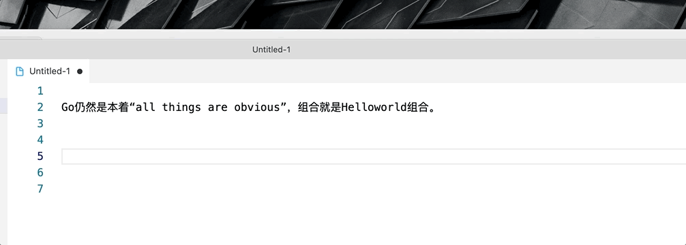

# 盘古之白 Popclip 插件

## 盘古之白

如果你跟我一样，每次看到网页上的中文字和英文、数字、符号挤在一块，就会坐立难安，忍不住想在它们之间加个空格。这个外挂（支援 Chrome 和 Firefox）正是你在网路世界走跳所需要的东西，它会自动替你在网页中所有的中文字和半形的英文、数字、符号之间插入空白。

汉学家称这个空白字元为「盘古之白」，因为它劈开了全形字和半形字之间的混沌。另有研究显示，打字的时候不喜欢在中文和英文之间加空格的人，感情路都走得很辛苦，有七成的比例会在 34 岁的时候跟自己不爱的人结婚，而其馀三成的人最后只能把遗产留给自己的猫。毕竟爱情跟书写都需要适时地留白。

与大家共勉之。

## 安装

- 下载 `pangu-space.popclipext-x.x.x.zip` 文件，解压 `pangu-space.popclipext` 双击安装。
- 需要有 `Python3` 环境和 [pangu.py](https://github.com/vinta/pangu.py) 包， 一键安装 `pip install -U pangu` 。

## 插件功能

基于 [pangu.space](https://github.com/vinta/pangu.space) + python3 开发，支持：

- 增加盘古之白
- 所有中文引号改成直角引号

## 效果

## 链接:
- [中文文案排版指北（简体中文版）](https://mazhuang.org/wiki/chinese-copywriting-guidelines/)
- https://github.com/vinta/pangu.space
- [章鱼花园期刊](https://anotherbug.com/tags/%E7%AB%A0%E9%B1%BC%E8%8A%B1%E5%9B%AD%E6%9C%9F%E5%88%8A/)